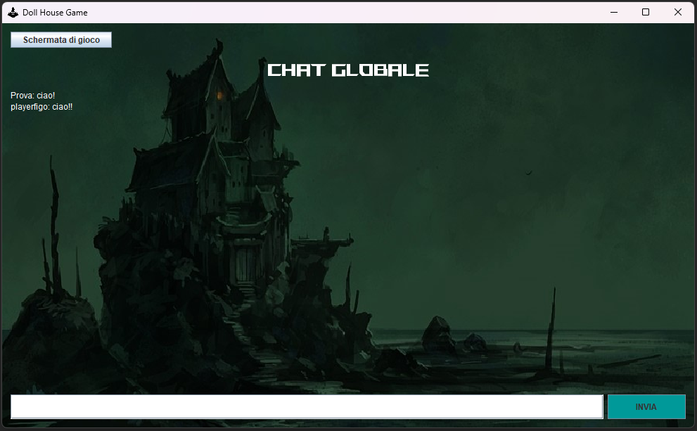
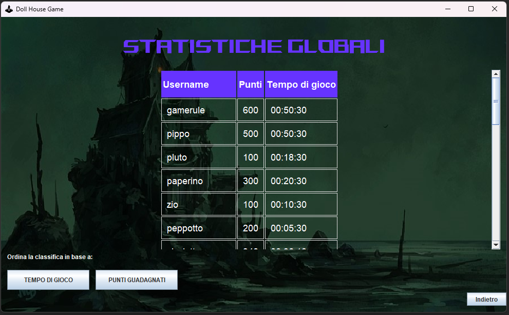

# Documentazione
## Indice
1. [Descrizione Generale](#1-descrizione-generale) <br>
    1.1 [La Storia](#11-la-storia) <br>
    1.2 [Il Team](#12-il-team) <br>
2. [Specifica Algebrica Selezionata](#2-specifica-algebrica-selezionata)
3. [Diagramma delle Classi Selezionato](#3-diagramma-delle-classi-selezionato)
4. [Applicazione Argomenti Trattati](#4-applicazione-argomenti-trattati) <br>
    4.1 [Programmazione OO](#41-programmazione-oo) <br>
    4.2 [Gestione delle Eccezioni](#42-gestione-delle-eccezioni) <br>
    4.3 [File](#43-file) <br>
    4.4 [Database](#44-database) <br>
    4.5 [Thread](#45-thread) <br>
    4.6 [Socket e Thread](#46-socket-e-thread) <br>
    4.7 [SWING](#47-swing) <br>
    4.8 [Lambda Expressions](#48-lambda-expressions) <br>
    4.9 [CheckStyle](#49-checkstyle) <br>

<br>

# **1. Descrizione Generale**

## **1.1 La Storia**
Benvenuto nell'avventura tetra e misteriosa di "DollHouse". In questa avventura testuale, ti ritrovi legato in una stanza buia, circondato da gabbie contenenti bambole. Davanti alla porta, un'inquietante figura ti rivela la verità: sei nella casa della _strega Aradia_, una temuta strega che ha trasformato più di 500 persone in bambole. L'unico modo per fuggire è uccidere la strega, che si trova al primo piano della casa, in questo modo riuscirai anche ad annullare 
l'incantesimo facendo tornare alla normalità tutte le sue vittime.

Il tuo primo obiettivo è convincere il _guardiano-bambola_ a liberarti. Dopo essere stato liberato, puoi esplorare lo scantinato e iniziare a raccogliere oggetti utili che ti serviranno durante il viaggio.

La casa si estende dallo scantinato verso il piano terra fino al primo piano. Man mano che esplori, incontri _bambole_ che ancora conservano la capacità di parlare. Alcune ti forniranno preziosi indizi per sconfiggere la strega, mentre altre tenteranno di intralciarti.

La strega Aradia rimane nella sua stanza, ma una volta che inizi a compiere azioni preimpostate, si attiva e inizia a cercare un modo per ucciderti. Fortunatamente, grazie a una **maschera** speciale (trovata nello scantinato), sei intangibile per lei. Devi essere astuto e superare le sfide per proseguire senza essere scoperto.

Sfruttando i suggerimenti delle bambole e combinando gli oggetti trovati con l'aiuto di un antico **libro magico**, puoi creare il **pugnale magico**. Questo strumento ti permetterà di sconfiggere la strega e invertire l'incantesimo di trasformazione.

Arriva il momento cruciale in cui entri nella stanza della strega, pronta a ucciderti. Tuttavia, tu sei preparato. Utilizzando il pugnale magico, le infliggi un colpo fatale, mettendo fine al suo regno di terrore e annullando l'incantesimo che ha imprigionato le persone sotto forma di bambole.

Con la morte della strega, la casa ritorna alla sua normale quiete. Ora sei libero di uscire da quella tenebrosa dimora insieme al guardiano-bambola e a tutti coloro che sono stati liberati dal suo incantesimo. La tua avventura nella "DollHouse" si conclude, e la luce della speranza brilla ancora una volta.

_Preparati ad affrontare l'orrore, risolvi enigmi e sopravvivi nella casa della strega Aradia!_

## **1.2 Il Team**
L'avventura testuale 'Doll House' è stata creata per l'esame di Metodi Avanzati di Programmazione tenuto dal professor Basile presso l'Università degli Studi di Bari Aldo Moro durante l'A.A. 22/23. Il team si compone di 3 persone: Nicolò Resta, Daniele Tonti e Natale Mastrogiacomo.

# **2. Specifica Algebrica Selezionata**

La specifica algebrica implementata è quella della struttura dati Insieme. Abbiamo utilizzato questa struttura dati per gestire la rimozione delle stopwords dal comando inserito tramite interfaccia grafica dall'utente.

**Specifica sintattica** :

Tipi: insieme, boolean, tipoelem.

Operazioni:

- creainsieme () -\> insieme;
- insiemevuoto (insieme) -\> boolean;
- appartiene (insieme, tipoelem) -\> boolean;
- inserisci (insieme, tipoelem) -\> insieme;
- cancella (insieme, tipoelem) -\> insieme;
- uguale (insieme, insieme) -\> boolean
- unione (insieme, insieme) -\> insieme
- intersezione (insieme, insieme) -\> insieme

**Specifica semantica** :

Dichiarazione variabili da usare:

A, A' : insieme; x,y : tipoelem; b : boolean.


- insiemevuoto (creainsieme ()) = true;
- insiemevuoto (inserisci (A,x) ) = true;
- appartiene (creainsieme (), y) = false;
- appartiene (inserisci (A, x), y) = If x=y then true, else if appartiene (A, y) then true else false;
- cancella (inserisci (A, x), y) = If x=y then A, else if appartiene (A, y) then cancella(A, y) else A';

**Specifica di restrizione** :

cancella (creainsieme(), y) = error;

**Implementazione nuovo operatore binario** :

uguale (insieme, insieme) -\> boolean

A,B : insieme; b : boolean; x,y : tipoelem


- uguale(creainsieme(), creainsieme()) = True
- uguale(creainsieme(),inserisci(A, x)) = False
- uguale(inserisci(B,y),creainsieme()) = False
- uguale(inserisci(B,y), inserisci(A, x)) = If x=y then uguale(A,B) else false

**Implementazione nuovo operatore binario** :

unione (insieme, insieme) -\> insieme

A,B : insieme; b : boolean; x,y : tipoelem


- unione(creainsieme(),creainsieme()) = creainsieme()
- unione(creainsieme(),inserisci(A, x)) = inserisci(A, x)
- unione(inserisci(B,y),creainsieme()) = inserisci(B, y)
- unione(inserisci(B, y), inserisci(A, x)) = If x = y then inserisci(unione(A, B), x) else inserisci(inserisci(unione(A, B), x), y)

**Implementazione nuovo operatore binario** :

intersezione (insieme, insieme) -\> insieme

A,B : insieme; b : boolean; x,y : tipoelem


- intersezione(creainsieme(),creainsieme()) = creainsieme()
- intersezione(creainsieme(),inserisci(A, x)) = creainsieme()
- intersezione(inserisci(B, y),creainsieme()) = creainsieme()
- intersezione(inserisci(B, y), inserisci(A,x)) = If x = y then if uguali(A,B) then inserisci(A, x) else inserisci(intersezione(A, B), x) else intersezione(A, B)

<br>

# **3. Diagramma delle Classi Selezionato**


Il diagramma delle classi selezionato in figura rappresenta il completo funzionamento dell'engine implementato per sviluppare Dollhouse.
Di seguito tale diagramma verrà analizzato da un punto di vista Top-Down che mette fortemente in risalto il vero flusso di esecuzione dell'intero engine durante l'esecuzione del programma.
Per poter rendere più leggibile il diagramma abbiamo semplificato alcune rappresentazioni e abbiamo deciso di nascondere molte informazioni implementative che avrebbero potuto disorientare. Questo diagramma ha il solo scopo di rappresentare come l'engine è stato progettato pertanto mancano molte delle rappresentazioni di tutte le altre classi del progetto.

## **3.1 GameHandler**
### (Classe ponte di controllo tra GUI ed ENGINE e responsabile di fornire i servizi di manipolazione dello stato del gioco)

La classe che racchiude l'intera gestione del gioco e che permette, a chiunque ne usufruisca, il pieno controllo di tutto ciò che può succedere nel gioco è la classe `GameHandler`. Tutti gli attributi e i metodi della classe `GameHandler` sono statici. Tali componenti sono stati progettati statici per diversi motivi:
- **FACILITA' D'INTEGRAZIONE GUI-ENGINE**: essendo `GameHandler` una classe progettata per gestire in maniera sicura (ovvero lasciare i dati sempre in una situazione di consistenza) tutte le possibili operazioni di manipolazione del gioco ed essendo, per questo, una delle due classi/componenti del sistema che fungono da ponte di controllo tra la componente grafica del progetto e la componente engine del progetto, la proprietà statica di tale classe è stata fondamentale per facilitare l'integrazione della GUI e dell'Engine del progetto. Tale proprietà ha permesso, ai moduli della GUI, di richiamare facilmente i servizi di `GameHandler`.
- **INDIPENDENZA DA COME `GameHandler` DEBBA ESSERE INZIALIZZATA/CREATA**: per garantire un basso accoppiamento tra la componente della GUI e la componente dell'Engine, abbiamo reso l'intera classe statica in modo tale da nascondere alla GUI il "come" la classe `GameHandler` venga inizializzata. Ciò ha permesso alla componente della GUI di richiamare soltanto i metodi strettamente necessari per la comunicazione con l'Engine. Ciò ci ha permesso di seguire facilmente il principio di presentazione separata secondo il quale la componente grafica del sistema è completamente indipendente dalla logica di programma.
La componente GUI richiama i soli metodi:
  - `onOpen()` e `onClose()` che racchiudono tutte le operazioni da effettuare sempre all'apertura del gioco
  - `executeCommand(final String command)` che esegue il comando passato come parametro e ne restituisce l'output.
- **FACILE UTILIZZO DA PARTE DEGLI SCRIPT DELL'ENGINE**: grazie alla sua proprietà statica qualsiasi oggetto che implementa l'interfaccia `GameScript`, modulo dell'engine che ha la responsabilità e il compito di modificare lo stato del gioco, può accedervi per modificare facilmente lo stato di avanzamento del gioco.

Di seguito è mostrato un Diagramma delle componenti per visualizzare graficamente l'integrazione effettuata tra GUI ed Engine e per visualizzare la gestione della comunicazione tra questi due componenti in modo da garantirne una facile manutenibilità ed estensione.

(Non tutte le componenti rappresentate corrispondono fedelmente a classi implementate nel progetto. Alcune sono componenti astratte che permettono di racchiundere tutte le classi implementate di semantiche comuni in modo da visualizzare con precisione come avviene la comunicazione tra questi. Il seguente diagramma evidenzia, anche, come è stato suddiviso il lavoro all'interno del team).


`GameHandler` ha il compito di gestire il flusso di esecuzione dei comandi di gioco. Per farlo ha bisogno di gestire, attraverso un `GameParser`, tutti i comandi che il giocatore digita. La componente GUI, una volta che il giocatore ha digitato il comando da eseguire, richiama il metodo `executeCommand()` di `GameHandler` che si occuperà di effettuare il parsing del comando e di eseguirlo. Una volta eseguito il parsing dei comandi, il cui risultato viene restituito dal parser sotto forma di oggetto `ParsedInput`, il metodo `executeCommand()` cerca di eseguire il comando. Se durante l'esecuzione del comando si verificano eventuali eccezioni, esse vengono rilanciate al modulo della GUI che si occupa di notificarle all'utente attraverso dei `JOptionPane`. Se, invece, l'esecuzione del comando va a buon fine, `executeCommand()` restituisce al chiamante l'output del comando eseguito da dover notificare al giocatore. L'esecuzione del comando comporta principalmente due fasi:
- FASE DI RICERCA DELL'ENTITA' SU CUI EFFETTUARE L'AZIONE
- FASE DI RICERCA DELL'AZIONE DA EFFETTUARE SU TALE ENTITA'

Queste due ricerche, nel caso in cui diano esito positivo, memorizzano l'entità da manipolare e l'azione da effettuare nei campi statici `currentEntity` e `currentAction` in modo da renderli facilmente accessibili dagli oggetti che implementano `GameScript` (vedere il sotto paragrafo di `GameScript`). `GameHandler` fornisce anche i metodi:
- `newGame()`: che inizia una nuova partita
- `loadGame()`: che carica una partita già iniziata
- `saveGame()`: che salva una partita in corso
- `endGame()`: che termina la partita attualmente in corso insieme all'attributo booleano isEnded.
`GameHandler` ci ha permesso di applicare il principio di Information Hiding nascondendo agli altri componenti del sistema il "come" l'esecuzione dei comandi avviene ma allo stesso tempo di fornire le informazioni minime necessarie per manipolare lo stato di avanzamento del gioco. Grazie ad esso, infatti, le componenti GUI e `GameScript` che la utilizzano si sono affrancate dalla responsabilità di gestire l'interpretazione dei comandi.

## **3.2 Classi dell'engine**

La classe `Game` ha il compito di incapsulare e gestire correttamente tutte le informazioni necessarie per rappresentare una partita di un player al gioco Dollhouse. Essa gestisce la mappa di gioco che il giocatore sta attualmente esplorando e con cui sta attualmente interagendo. Essa incapsula anche il giocatore stesso in modo tale da rendere facilmente accessibile le sue informazioni a tutti gli utilizzatori della classe `Game`. Tale classe, così come tutti i componenti che essa ha bisogno, implementa l'interfaccia `Serializable`. Ciò ci permette di salvare la partita corrente del giocatore in un file binario in modo da salvarla e ricaricarla con estrema facilità.

La classe `GameMap` ha il compito di gestire tutto ciò che riguarda il caricamento e la manipolazione della mappa di gioco. Tale classe gestisce la stanza corrente che il giocatore sta esplorando o con il quale sta interagendo. La mappa inizialmente viene caricata tramite i file JSON. Quando le sue componenti vengono modificate, l'oggetto `GameMap` viene salvato in un file binario per poi essere ricaricata da lì. Essa fornisce i metodi `(run/stop)AllBehavioralNpcs()` che forniscono un'interfaccia per far iniziare o fermare l'esecuzione dei thread relativi agli NPC comportamentali.

La classe `GameRoom` ha il compito di gestire tutte le `GameEntity` presenti in tale stanza e di gestire i collegamenti con altre eventuali stanze. Per farlo essa mantiene una `Collection` (attualmente implementata come `ArrayList`) di `GameEntity` (di oggetti o NPC non comportamentali) con il quale il giocatore può interagire e un'altra `Collection` (attualmente implementata come `ArrayList`) di `GameBehavioralNpc` presenti nella stanza. Tale suddivisione è stata applicata per poter fermare/iniziare l'esecuzione dei thread relativi ai `GameBehavioralNpc` più facilmente. Tali strutture sono i luoghi in cui viene effettuata la ricerca sull'entità su cui effettuare l'azione. Tale classe fornisce `findEntity()` e `findBehavioralNpc()` che implementano la ricerca dell'entità con il nome passato come parametro. L'astrazione `GameEntity` ci ha permesso, attraverso il principio di sostituzione di Liskov, di gestire più facilmente le entità di gioco e di implementare e rendere più facile le eventuali estensioni all'engine. I metodi `(run/stop)BehavioralNpc()` hanno il compito di iniziare/fermare l'esecuzione dei thread associati ai `GameBehavioralNpc` nella stanza in quesitone.

La classe `GameEntity` è la classe chiave che descrive tutte le entità che possono essere presenti nel gioco. Una `GameEntity` è una qualsiasi entità nel gioco con il quale il player può interagire tramite delle azioni. Essa gestisce tutte le informazioni necessarie per identificarla e gestisce tutte le azioni che possono essere effettuate su di essa. Per poterlo fare mantiene una `Collection` di Alias e di `GameAction`. Il metodo `isAliasOf()` viene utilizzato dal metodo `findEntity()` di `GameRoom` per verificare che la stringa passata come parametro sia un alias dell'oggetto in modo tale da identificarlo. Il metodo `findAction()` viene utilizzato per trovare un'azione che ha la string passata come parametro come un alias. Le classi `GameNpc`, `GameBehavioralNpc`, `GamePlayer` e `GameCraftableObject` sono tutte classi che ereditano `GameEntity` ed estendono le sue responsabilità. I `GameNpc` sono tutti gli npc con il quale è possibile parlare, i `GameBehavioralNpc` sono tutti gli NPC che hanno un comportamento autonomo mediante thread e i `GameCraftableObject` sono tutti quegli oggetti che possono essere costruiti mediante una combinazione di altre `GameEntity`.
La classe `GamePlayer` ha il compito di gestire tutte le informazioni relative al player come il tempo di gioco gestito dalla classe `GameTimer` e le statistiche di gioco gestite dalla classe `GameStatistics`.

Una delle classi fondamentali dell'engine è l'interfaccia `GameScript`. Essa definisce l'interfaccia che tutte le classi "script" devono implementare per poter essere eseguite correttamente dall'engine. Un'istanza che implementa `GameScript` corrisponde ad una `GameAction`, o ad un qualsiasi oggetto, che modifica lo stato di avanzamento del gioco. Tale interfaccia è stata progettata per gestire in modo efficace e generale tutte quelle azioni che modificano lo stato attuale del gioco in modo tale da rendere più semplice l'implementazioni delle quest e delle azioni previste che modificano lo stato attuale del gioco. Tale interfaccia ci ha permesso anche di definire per ciascuna azione importante il proprio script mediante file JSON in modo tale da rendere il caricamento e l'inizializzazione della mappa molto più semplice. Di tutti i moduli dell'engine, quelli che implementano `GameScript` sono gli unici moduli che possono modificare lo stato attuale del gioco e per questo sono stati importanti per effettivamente implementare Dollhouse. I moduli che implementano `GameScript` usufruiscono della classe `GameHandler` per manipolare lo stato del gioco.

# **4. Applicazione Argomenti Trattati**

## **4.1 Programmazione OO**

### Paradigma della Programmazione Orientata agli Oggetti (OO)
Nello sviluppo del progetto è stato applicato il paradigma della **Programmazione Orientata agli Oggetti (Object Oriented, OO)**. Questo approccio organizza il codice intorno agli oggetti, che rappresentano entità del mondo reale o concetti astratti. I tre principi fondamentali della POO sono l'**Incapsulamento**, l'**Information Hiding**, l'**Ereditarietà** e il **Polimorfismo**.

#### Incapsulamento e Information Hiding
Incapsulamento e Information Hiding sono due dei principi cardine del paradigma orientato agli oggetti. Gli oggetti incapsulano uno stato e un comportamento. Lo stato è identificato da una certa area di memoria, mentre il comportamento è definito da un insieme di procedure e funzioni (metodi) che operano sulla rappresentazione dell'area di memoria associata all'oggetto.

Questi due principi consentono di utilizzare gli oggetti esclusivamente attraverso metodi pubblici. Inoltre, dichiarando privati gli attributi delle varie classi, facciamo in modo che questi non siano accessibili direttamente da altre classi o oggetti, offrendo un maggiore controllo sull'accesso e la modifica dei dati di una classe.

Prendiamo come esempio le classi `GameStatistics` e `GameTimer`:

```java
public class GameStatistics implements Serializable {
  private static final int minNumberOfExecutedActions = 20;
  private GameTimer timer;
  private int numberOfExecutedActions;

  public GameStatistics();

  public GameTimer getTimer();

  public void incrementsNumberOfExecutedActions();

  public int getNumberOfExecutedActions();

  public int getPoints() {
    int over = numberOfExecutedActions - minNumberOfExecutedActions;
    int points = 500;
    if (over > 0) {
      points -= (over * 5);
      if (points < 1) {
        points = 1;
      }
    }
    return points;
  }
```
```java
public class GameTimer implements Serializable {
  private transient long initialTime;
  private long gameTime;
  private static final double NANOTIME_TO_SECONDS = 1e9;
  private static final double SECONDS_TO_MINUTES = 60;

  public GameTimer();
  public void startTimer();
  public long getElapsedTimeInSeconds();
  public void updateGameTime();

  public String getGameTime() {
    long seconds = getElapsedTimeInSeconds();
    long hour = (long) ((seconds / SECONDS_TO_MINUTES) / SECONDS_TO_MINUTES);
    long minutes = (long) ((seconds / SECONDS_TO_MINUTES) % SECONDS_TO_MINUTES);
    String hh;
    String mm;
    String ss;
    seconds %= SECONDS_TO_MINUTES;
    if (hour < 10) {
      hh = "0" + Long.toString(hour);
    } else {
      hh = Long.toString(hour);
    }
    if (minutes < 10) {
      mm = "0" + Long.toString(minutes);
    } else {
      mm = Long.toString(minutes);
    }
    if (seconds < 10) {
      ss = "0" + Long.toString(seconds);
    } else {
      ss = Long.toString(seconds);
    }
    return hh + ":" + mm + ":" + ss;
  }
}
```
(per semplicità di visualizzazione, viene mostrata solo l'implementazione di _getPoints_ e _getGameTime_).

Nell'ambito della programmazione orientata agli oggetti, chi usa un oggetto non è sempre interessato a conoscere come è implementato, bensì vuole sapere come interagire con l'oggetto, quali sono i metodi che mette a disposizione e gli attributi pubblici.

Il vantaggio introdotto dall'Information Hiding consiste nel nascondere la parte implementativa dell'oggetto (come vengono realizzati i metodi), basta conoscere come esso viene utilizzato: nel nostro caso, richiamando il metodo _getPoints_ si otterrà direttamente il punteggio, senza necessariamente sapere il modo in cui questo viene calcolato (rispettivamente, richiamando _getGameTime_ viene restituito direttamente il tempo di gioco).

#### Ereditarietà
Nella progettazione e programmazione OO una relazione fondamentale è quella esistente tra le classi: la relazione di ereditarietà. Una classe, detta `superclasse`, può essere specializzata definendo una `sottoclasse` che ne contenga casi particolari. La sottoclasse eredita dalla superclasse lo stato e il comportamento (possiede quindi tutti gli attributi e tutti i metodi della superclasse, con la possibilità di aggiungere e modificarne alcuni).

Di seguito vengono mostrati diversi esempi di ereditarietà:

```java
public class GameEntity implements Serializable {
  protected String name;
  protected Collection<GameAction> actions;
  protected Collection<String> aliases;

  public GameEntity(final String name);
  public String getAlias(final int position);
  public boolean isAliasOf(final String alias);
  public GameAction findAction(final String name);
  public void addAction(final GameAction action);
  public void removeAction(final GameAction action);
  public void addAlias(final String alias);
  public void setName(final String name);
  public String getName();
}
```
```java
public class GameNpc extends GameEntity {
  private List<GameDialogue> dialogues;

  public GameNpc(String name);
  public void addDialogue(final GameDialogue dialogue); 
  public GameDialogue getDialogue(final int position); 
  public int getNumberOfDialogues(); 
  public String getStringDialogues();
}
```
```java
public class GameBehavioralNpc extends GameNpc implements Runnable {
  protected transient Thread thread;
  private GameScript script;
  protected List<String> rooms;
  private Random random;

  public GameBehavioralNpc(String name); 
  public void addRoom(final String room);
  public void setGameScript(final GameScript script); 
  public Thread getThread(); 
  public void start(); 
  public void stop();
  private String executeRandomBehavior();
}
```
```java
public class GameCraftableObject extends GameEntity {
  private List<String> recipe;

  public GameCraftableObject(final String name); 
  public void addToRecipe(final String item);
  public List<String> getRecipe();
}
```
Rifacendoci anche al diagramma delle classi, possiamo notare che c'è una relazione di ereditarietà tra `GameNpc`, `GameBehavioralNpc`, `GameCraftableObject` e `GameEntity` (le prime estendono l'ultima). In particolare, le 3 sottoclassi ereditano dalla superclasse metodi ed attributi e ne definiscono di nuovi, in questo caso parliamo di `ereditarietà per estensione`: infatti la sottoclasse introduce caratteristiche non presenti nella superclasse e non applicabili a istanze di essa.

#### Polimorfismo
Il Polimorfismo è un altro concetto utilizzato nell'esempio di studio. Esso è stato implementato attraverso l'introduzione, fra le altre cose, di una interfaccia chiamata `GameScript.java` la quale definisce 3 metodi astratti `execute()`, `isOver()` e `getException()`. 

```java
public interface GameScript {

  public abstract String execute();

  public abstract boolean isOver();

  public abstract Exception getException();

}
```

Questa interfaccia è stata implementata da tutte le classi che rappresentano gli script di gioco, presenti nel path `/engine/entities/actions/extra` e `/engine/entities/scripts`. Ogni classe implementerà quindi i tre metodi in base alle operazioni eseguite dallo script di riferimento. Questo ci permette di utilizzare gli script in maniera polimorfica, ossia di poter utilizzare un oggetto che implementa `GameScript` per eseguire un qualsiasi script di gioco, senza dover conoscere a priori il tipo di script che si sta eseguendo. Di seguito un esempio di implementazione attuata nel file `MaskScript.java` e `TalkToNpc.java`:

```java
public class MaskScript extends GameAction implements GameScript {

  private Exception exception;

  public MaskScript(final String output) {
    super(output);
    exception = null;
  }

  private GameEntity getTrapdoor() {
    FileReader fileReader = null;
    GameEntity trapdoor = null;
    try {
      fileReader = new FileReader("./res/objects/trapdoor.json", Charset.defaultCharset());
      JSONParser parser = new JSONParser();
      JSONObject jsonTrapdoor = (JSONObject) parser.parse(fileReader);
      trapdoor = JsonLoader.getGameEntity(jsonTrapdoor);
    } catch (IOException | ParseException | ClassNotFoundException | NoSuchMethodException
            | InstantiationException | IllegalAccessException | IllegalArgumentException
            | InvocationTargetException e) {
      exception = e;
    }
    return trapdoor;
  }

  @Override
  public String execute() {
    GameRoom room = GameHandler.getGame().getMap().getCurrentRoom();
    room.removeEntity(room.findEntity("Botola"));
    room.addEntity(getTrapdoor());
    GameHandler.getGame().getPlayer()
              .getGameInventory().findGameObject("Maschera").removeAction(this);
    return this.output;
  }

  @Override
  public boolean isOver() {
    return true;
  }

  @Override
  public Exception getException() {
    return exception;
  }
}
```
```java
  @Override
  public String execute() {
    GameNpc entity = (GameNpc) GameHandler.getCurrentEntity();
    String output = "Opzione non disponibile!";
    if (isRunning) {
      ParsedInput input = GameHandler.getParsedInput();
      try {
        int choice = Integer.valueOf(input.getAction());
        if (choice == 0) {
          isRunning = false;
          output = this.output + "Hai smesso di parlare con " + entity.getName();
          GameHandler.getGame().getMap().runAllBehavioralNpcs();
        } else {
          output = entity.getDialogue(choice - 1).getAnswer();
          output += "\n0) Smetti di parlare con " + entity.getName()
                    + "\n" + entity.getStringDialogues();
        }
      } catch (NumberFormatException | IndexOutOfBoundsException e) {
        output = "Stai ancora parlando con " + entity.getName() + "\n";
        output += "Premi 0) per smettere di parlare con " + entity.getName();
      }
    } else {
      isRunning = true;
      output = "0) Smetti di parlare con " + entity.getName() + "\n" + entity.getStringDialogues();
      GameHandler.getGame().getMap().stopAllBehavioralNpcs();
    }

    return output;
  }

  @Override
  public boolean isOver() {
    return !isRunning;
  }

  @Override
  public Exception getException() {
    return null;
  }
```
Da queste brevi spiegazioni, emergono i principali concetti del paradigma della Programmazione Orientata agli Oggetti utilizzati nel caso di studio. Tuttavia, è importante sottolineare che il paradigma OO offre molte altre potenti tecniche e possibilità per creare software strutturato, modulare e flessibile.

## **4.2 Gestione delle Eccezioni**

Nel nostro progetto, abbiamo fatto un ampio uso delle eccezioni per garantire la robustezza e l'affidabilità del software. Ogni metodo è stato progettato con cura per catturare e gestire adeguatamente eventuali situazioni anomale o errori nel codice.

### Principali Categorie di Eccezioni Utilizzate:

1. `Eccezioni di Connessione`: Abbiamo implementato meccanismi per gestire eccezioni riguardanti connessioni a risorse esterne, come database. In questo modo, garantiamo una maggiore resilienza alle operazioni e una gestione adeguata di eventuali problemi di rete. Di seguito un esempio:

```java
private GameWindow() {
    try {
      initComponents();
      setContentPane(new MenuPanel());
      DataBaseLoader.initializeDbConnection();
      DataBaseLoader.createTable();
    } catch (SQLException e) {
      JOptionPane.showMessageDialog(this, e,
                                    "Connessione al database fallita!", JOptionPane.ERROR_MESSAGE);
      GameWindow.getInstance().updatePanel(new MenuPanel());
    }
  }
```

2. `Eccezioni di File`: Abbiamo implementato la gestione di eccezioni relative all'accesso a file o operazioni di I/O. Questo include situazioni come mancanza di autorizzazioni di accesso, file non trovati o errori di lettura/scrittura. Di seguito un esempio:

```java
public GameParser() throws FileNotFoundException {

    String line;
    Scanner fileScanner = null;
    try {
      File file = new File("./res/parser/stopwords.txt");
      fileScanner = new Scanner(file);

      while (fileScanner.hasNextLine()) {
        line = fileScanner.nextLine();
        stopwords.add(line);
      }

    } catch (FileNotFoundException e) {
      throw e;
    } finally {
      if (fileScanner != null) {
        fileScanner.close();
      }
    }
  }
```

3. `Eccezioni di MultiThreading`: Dove necessario, abbiamo adottato strategie per gestire eccezioni correlate a problemi di concorrenza in ambienti multithreading. Questo ci permette di garantire stabilità e coerenza nelle operazioni. Di seguito un esempio:

```java
public void run() {
    boolean isRunning = true;
    String output;
    
    while (isRunning) {
      try {
        Thread.sleep((long) 25e3);
        do {
          output = executeRandomBehavior();
          if (GameHandler.getGame().getMap().getCurrentRoom().findBehavioralNpc(name) != null) {
            GuiHandler.print("\n" + this.getName() + ": " + output + "\n");
          }
          if (script.getException() != null) {
            script.getException().printStackTrace();
          }
        } while (!script.isOver());
      } catch (InterruptedException e) {
        isRunning = false;
      }
    }
  }
```

4. `Eccezioni Personalizzate`: Abbiamo creato eccezioni personalizzate per rappresentare situazioni specifiche all'interno del nostro dominio di applicazione. Questo ci permette di fornire contesti dettagliati e informativi riguardo ai problemi che si verificano durante l'esecuzione del programma.

```java
public void windowClosing(WindowEvent e) {
    try {
      if (GameHandler.getGame() != null) {
        GameHandler.onClose();
      }
    } catch (Exception e1) {
      JOptionPane.showMessageDialog(this, e1.getMessage(),
                              "Salvataggio fallito!", JOptionPane.ERROR_MESSAGE);
    }
  }
```

### Vantaggi dell'Approccio alle Eccezioni

L'uso responsabile delle eccezioni è essenziale per la creazione di un software affidabile e resistente agli errori. In particolare, sono garantite:

- **Maggiore Affidabilità**: La gestione oculata delle eccezioni ci consente di fronteggiare situazioni impreviste in modo più efficace, riducendo il rischio di malfunzionamenti o crash del programma.

- **Chiarezza e Precisione**: Le eccezioni personalizzate e i messaggi di errore accurati migliorano l'esperienza dell'utente, fornendo informazioni utili e comprensibili su eventuali problemi verificatisi.

- **Facilità di Manutenzione**: La corretta gestione delle eccezioni semplifica la manutenzione del codice, consentendo ai membri del team di identificare e risolvere rapidamente eventuali anomalie.

- **Coerenza nel Codice**: L'uso sistematico delle eccezioni assicura uniformità nello stile di programmazione, facilitando la collaborazione e la comprensione del codice da parte di tutti i membri del team.

## **4.3 File**

I File sono stati utilizzati per il `caricamento dei dati di gioco` (dialoghi delle bambole, descrizioni delle stanze e degli oggetti, informazioni sulle azioni da compiere), per gli `script di gioco` (script per la creazione del pugnale magico e script per la sconfitta della strega). Il tutto è stato definito attraverso file in formato _json_.

(Paragrafo 4.3.1 e 4.3.2 per maggiori informazioni).

I file, inoltre, sono stati utilizzati anche per il `salvataggio dei dati` quando viene chiuso il gioco, come ad esempio il giocatore e tutte le informazioni ad esso correlate, gli oggetti raccolti che compongono l'inventario, posizione del giocatore nella mappa ed altre informazioni da salvare per dare la possibilità al player di riprendere il gioco in un qualsiasi momento.

(Paragrafo 4.3.3 per maggiori informazioni).

Ulteriore utilizzo è legato all'`operazione di parsing` del comando inserito dall'utente in cui vengono rimosse eventuali stopwords ricercandole fra una lista presente in un apposito file.

(Paragrafo 4.3.5 per maggiori informazioni).

### **4.3.1 File JSON per l'inizializzazione dell'oggetto `GameMap`**

In particolare i file JSON vengono utilizzati dal programma per inizializzare i dati di cui la mappa e le sue stanze hanno bisogno per poter essere correttamente giocate dal giocatore. Un file JSON descrive interamente l'oggetto `GameMap` che, ogni volta che il giocatore entra per la prima volta nella mappa in questione, viene istanziato caricando tutte le informazioni salvate nei JSON. Le informazioni salvate nei JSON per il caricamento della mappa sono:

- Nome della mappa
- Tutte le `GameRoom` (stanze) presenti nella mappa
- Per ogni `GameRoom` presente nella mappa sono salvate le seguenti informazioni:

    - Nome
    - Descrizione
    - Lista di nomi delle stanze adiacenti ad essa
    - Lista di oggetti presenti nella `GameRoom`
    - Lista di npc presenti nella `GameRoom`

- Per ogni `GameEntity` (tra cui gli oggetti) sono salvate le seguenti informazioni:

    - Nome
    - Lista di alias
    - Lista di azioni effettuabili su di esso

- Per ogni `GameNpc` (NPC) sono salvate le seguenti informazioni:

    - Nome
    - Lista di alias
    - `GameScript` (Script di comportamento): alcuni NPC possono interagire con il mondo in maniera automatica e indipendente dalle azioni del giocatore. Ad ognuno di questi corrisponde un thread (descrizione più accurata nel paragrafo 4.5). Il campo "behavior" del file JSON per un NPC indica qual è la classe (script) da caricare in memoria quando il thread relativo all'NPC viene fatto partire (esso determina il comportamento dell'NPC durante il gioco).
    - Lista di possibili domande e risposte che il giocatore può fare/ottenere parlando con l'NPC
    - (OPZIONALE) Lista di frasi che vengono stampate ogni tanto durante il gioco (per rendere un po' più vivi gli NPC)
    - (OPZIONALE) Lista di stanze in cui possono interagire

- Per ogni `GameAction` (Azione)

    - Lista di alias
    - Stringa di output
    - `GameScript` (script) da eseguire nel caso in cui l'azione in questione deve modificare lo stato attuale del gioco.

Esempi di file json descritti in questo paragrafo sono presenti nel seguente percorso a partire dalla project root: `./res/maps` .
Un esempio di classe che ne fa un ampio uso è `./src/main/java/dijkstra/dollhouse/engine/levels/GameMap.java`.
Gli esempi precedenti non sono stati presentati nella documentazione a causa della loro lunghezza e complessità. Per comprenderli a pieno è necessario vederli nella loro completezza. Per questo sono stati riportati i percorsi ai file.

### **4.3.2 File JSON per l'inizializzazione di dati extra**

Nel gioco sono presenti alcune quest che sbloccano altre aree del gioco come la stanza in cui si svolge la battaglia finale con la strega, oppure quest che permettono (se completate) al giocatore di passare da un piano all'altro come per esempio la quest della bambola Ciro. Per poter implementare in maniera generica il tutto, per far sì che venissero rispettati i principi di OOP e che il codice sia facilmente estendibile e mantenibile, alcuni script utilizzano altri file json (extra) per l'inserimento di particolari oggetti che permettono di modificare lo stato del gioco e di far progredire il giocatore. Tali oggetti per poter essere inseriti devono essere inizializzati e la loro descrizione viene caricata tramite questi file json extra.

Esempi di file json utilizzati per aggiungere oggetti a run time in base a delle quest o gestiti da dei GameScript sono presenti nella seguente cartella a partire dalla project root: `./res/objects`.

Di seguito un esempio: 

```JSON
{
    "name": "./res/maps/piano_terra.json Salotto",
    "aliases": ["Botola","botola segreta","botola per piano terra","piano terra", "piano di sopra", "sopra","botola per il piano di sopra"],
    "actions": [
      {
        "aliases":["esamina","esaminare","osserva","osservare","ispeziona","ispezionare"],
        "output":"La botola nel centro dello scantinato è un'entrata vetusta e logora verso l'ignoto.\nRealizzata in legno consunto, offre un passaggio misterioso al piano superiore, suggerendo segreti sinistri e avventure inquietanti."
      },
      {
        "aliases":["apri","aprire","entra","entrare","usa","usare","utilizza"],
        "output": "",
        "script": "dijkstra.dollhouse.engine.entities.actions.predefined.ChangeMap"
      },
      {
        "aliases":["prendi","prendere","raccogli","raccogliere"],
        "output":"Ma come potrebbe mai essere possibile prendere una botola?!"
      },
      {
        "aliases":["rimuovi","rimuovere","lascia","lasciare"],
        "output":"L'oggetto non è contenuto nell'inventario."
      }
    ]
}(./res/objects/trapdoor.json)
```

Esempi di file json utilizzati per inizializzare altri tipi di azioni sono presenti nella seguente cartella a partire dalla project root: `./res/actions`.

Di seguito un esempio: 

```JSON
{
    "craftable_objects": [
        {
            "name": "Coltello magico",
            "aliases": ["coltello"],
            "recipe": ["Manico", "Scheggia", "Gomitolo", "Libro Incantato"],
            "actions": [
              {
                "aliases": ["esamina","esaminare","osserva","osservare","ispeziona","ispezionare"],
                "output": "Un'arma speciale, creata appositamente per uccidere la strega."
              }
            ]
        }
    ]
}
(./res/actions/craftable_objects.json)
```

### **4.3.3 File `.dat` per il salvataggio dei dati di gioco**

Per salvare la partita e mantenere tutte le modifiche che il player ha eseguito nel mondo, sono stati utilizzati dei file .dat (binari) in cui è stato salvato l'oggetto `Game` responsabile di gestire tutte le informazioni riguardanti una partita effettuata da un giocatore. Per poter salvare ogni oggetto necessario, tutte le classi che descrivono oggetti da salvare su file in binario implementano l'interfaccia `Serializable`.

Esempi di file .dat (binari) sono presenti nella seguente cartella a partire dalla project root: `./res/savings`.

### **4.3.4 File `./res/initialOutput.txt`**

Il file `./res/initialOutput.txt` è stato impiegato per poter stampare la descrizione iniziale del gioco.

### **4.3.5 File `./res/parser/stopwords.txt`**

Il file `./res/parser/stopwords.txt` è stato impiegato per caricare tutte le parole da filtrare nell'input dell'utente in modo da riconoscere, nel comando, soltanto i due elementi essenziali per poter eseguire un'azione: [azione] [entità].

## **4.4 Database**
Per quanto riguarda l'utilizzo dei database, abbiamo utilizzato il database engine H2. In particolare, all'interno del database _statistics_, per ogni partita terminata abbiamo memorizzato: username del giocatore, tempo di gioco e punti guadagnati. 

Per fare in modo che i dati vengano salvati al termine della partita abbiamo utilizzato la seguente istruzione: 

```java
DataBaseLoader.updateStatistics(player.getName(),
                                        player.getGameStatistics().getPoints(),
                                        Time.valueOf(player.getGameStatistics()
                                                    .getTimer().getGameTime()));
```
che ci permette di avvalorare tutti i campi della tabella _statistics_.

Per calcolare il tempo di gioco abbiamo utilizzato un'apposita classe `GameTimer` con i seguenti metodi che ci permettono rispettivamente di inizializzare il timer, calcolare il tempo trascorso e aggiornare il timer.

```java
public void startTimer() {
    initialTime = System.nanoTime();
  }

  public long getElapsedTimeInSeconds() {

    return (long) (((System.nanoTime() - initialTime) / NANOTIME_TO_SECONDS)) + gameTime;
  }

  public void updateGameTime() {
    gameTime = getElapsedTimeInSeconds();
    initialTime = System.nanoTime();
  }
```
Inoltre viene usato il metodo _getGameTime_ che ci permette di visualizzare il tempo di gioco effettivo. 
Quando la finestra di gioco viene chiusa memorizziamo il tempo di gioco corrente, in questo modo quando l'utente riprende la partita il tempo non ricomincia da zero. 

Per quanto riguarda invece il conteggio dei punti, inizialmente vengono assegnati ad ogni utente 500 punti. Fino a quando il numero di mosse effettuate dall'utente è minore o uguale al numero minimo di mosse necessarie per terminare il gioco (definito a priori), il punteggio rimane invariato, quando il numero di mosse eccede la quota minima, all'utente vengono tolti 5 punti per ogni azione 'non prevista'. Il punteggio viene calcolato con il metodo _getPoints_ della classe `GameStatistics`.

```java
public int getPoints() {
    int over = numberOfExecutedActions - minNumberOfExecutedActions;
    int points = 500;
    if (over > 0) {
      points -= (over * 5);
      if (points < 1) {
        points = 1;
      }
    }
    return points;
  }
```

Tornando all'effettivo utilizzo del database statistics: quando l'utente accede al panel delle statistiche, esso visualizza una tabella contenente i dati di gioco di tutte e sole le partite terminate (in ordine cronologico). In particolare, cliccando su appositi bottoni, la tabella verrà 'aggiornata' e mostrerà la 'classifica' delle partite sulla base del tempo di gioco o dei punti guadagnati.

Nello specifico la porzione di codice riportata è quella che permette l'aggiornamento della tabella presente nel panel delle statistiche.

```java
public static String printUserData(String mode) throws SQLException {
    StringBuilder result = new StringBuilder();
    ResultSet rs;
    Statement stmt = conn.createStatement();
    String username;
    String time;
    int points;
    rs = stmt.executeQuery("SELECT * FROM statistics");
    Collection<Statistic> statistics = new ArrayList<>();
    while (rs.next()) {
      username = rs.getString("username");
      points = rs.getInt("points");
      time = rs.getString("time");
      statistics.add(new Statistic(username, points, time));
    }
    switch (mode) {
      case "time":
        statistics.stream()
                  .sorted((s1, s2) -> {
                    Time t1 = Time.valueOf(s1.getTime());
                    Time t2 = Time.valueOf(s2.getTime());
                    return t1.compareTo(t2);
                  })
                  .map(s -> {
                    return "<tr> <td>" + s.getUsername()
                      + "</td> <td>" + s.getPoints()
                      + "</td><td>" + s.getTime() + "</td> </tr>";
                  })
                  .forEach(row -> result.append(row));
        break;
      case "points":
        statistics.stream()
                  .sorted((s1, s2) -> {
                    if (s1.getPoints() > s2.getPoints()) {
                      return -1;
                    }
                    if (s1.getPoints() < s2.getPoints()) {
                      return 1;
                    }
                    return 0;
                  })
                  .map(s -> {
                    return "<tr> <td>" + s.getUsername()
                      + "</td> <td>" + s.getPoints()
                      + "</td><td>" + s.getTime() + "</td> </tr>";
                  })
                  .forEach(row -> result.append(row));
        break;
      default:
        statistics.stream()
                  .map(s -> {
                    return "<tr> <td>" + s.getUsername()
                      + "</td> <td>" + s.getPoints()
                      + "</td><td>" + s.getTime() + "</td> </tr>";
                  })
                  .forEach(row -> result.append(row));
        break;
    }
    rs.close();
    stmt.close();
    return result.toString();
  }
```

  La scelta dell'username da parte del giocatore è molto importante, visto che l'username deve essere univoco. Di conseguenza quando l'utente, dopo aver inserito il proprio username all'interno dell'apposita JTextField, preme il bottone _INIZIA_ viene fatto un controllo su tutti gli username presenti nella tabella statistics.
  Se l'username inserito dall'utente è già presente nella tabella allora questo dovrà essere cambiato, in caso contrario la partita potrà iniziare.
  Di seguito il codice di controllo dello username presente in `./src/main/java/dijkstra/dollhouse/DataBaseLoader.java`:

  ```java
public static boolean usernameAlreadyUsed(String username) throws SQLException {
    boolean result = false;
    PreparedStatement stmt = conn.prepareStatement("SELECT * FROM statistics WHERE username = ?");
    stmt.setString(1, username);
    ResultSet rs = stmt.executeQuery();
    if (rs.next()) {
      result = true;
    }
    rs.close();
    stmt.close();
    return result;
  }
  ```

## **4.5 Thread**
I Thread sono stati impiegati per realizzare differenti funzionalità:
- **COMPORTAMENTI DEGLI NPCs**: alcuni tra gli NPC sono stati catalogati come comportamentali,infatti hanno un comportamento indipendente dalle azioni del player. Per poter rendere indipendente l'esecuzione dei loro comportamenti dal normale flusso di esecuzione del gioco, ad ognuno di questi NPC corrisponde un thread che viene eseguito in parallelo all'esecuzione del gioco.
Tra i comportamenti più importanti degli NPC comportamentali ci sono:
    - **SPOSTAMENTI**: ogni NPC comportamentale, durante l'esecuzione del gioco, può spostarsi in una stanza casuale tra un set predefinito di stanze (caricato precedentemente dal file json della mappa in cui l'NPC è inizialmente collocato). Questa 'funzionalità' ha inevitabilmente comportato la gestione degli accessi concorrenti di questi thread alla lista dei `GameBehavioralNpc` per poter evitare situazioni di inconsistenza dei dati durante l'esecuzione del gioco. La mutua esclusione è stata garantita rendendo atomici (non interrompibili, attraverso l'utilizzo della clausola `synchronized`) i metodi che tali thread utilizzano per modificare la lista dei `GameBehavioralNpc` presente nella `GameRoom`. 

  Di seguito il codice dei metodi `add/removeBehavioralNpc()` di `GameRoom`:
    ```java
    public synchronized void addBehavioralNpc(final GameBehavioralNpc npc) {
    npcs.add(npc);
  }

  public synchronized void removeBehavioralNpc(final GameBehavioralNpc npc) {
    npcs.remove(npc);
  }
  ```

  Si seguito una porzione di codice di `GameBehavioralNpc`:

  ```java
  private String executeRandomBehavior() {
    int index = random.nextInt(0, 2);
    String output = "";

    if (index == 0) {
      index = random.nextInt(0, rooms.size());
      output = name + " entra in " + rooms.get(index);
      GameRoom newRoom = GameHandler.getGame().getMap().getRoom(rooms.get(index));
      GameRoom oldRoom = GameHandler.getGame().getMap().getBehavioralNpcRoom(name);
      oldRoom.removeBehavioralNpc(this);
      newRoom.addBehavioralNpc(this);
    } else {
      output = script.execute();
    }

    return output;
  }

  @Override
  public void run() {
    boolean isRunning = true;
    String output;

    
    while (isRunning) {
      try {
        Thread.sleep((long) 25e3);
        do {
          output = executeRandomBehavior();
          if (GameHandler.getGame().getMap().getCurrentRoom().findBehavioralNpc(name) != null) {
            GuiHandler.print("\n" + this.getName() + ": " + output + "\n");
          }
          if (script.getException() != null) {
            script.getException().printStackTrace();
          }
        } while (!script.isOver());
      } catch (InterruptedException e) {
        isRunning = false;
      }
    }
  }
  ```

  - **FRASI CASUALI**: ogni NPC comportamentale, durante l'esecuzione del programma, può stampare un messaggio casuale da un set predefinito di frasi (caricato precedentemente dal file json della mappa in cui l'NPC è inizialmente collocato).<br><br>
    (Tali classi si possono trovare in `./src/main/java/dijkstra/dollhouse/engine/entities` per le entità e in `./src/main/java/dijkstra/dollhouse/engine/entities/scripts` per i `GameScript` (comportamenti) associati a tali NPC)<br><br>
- **CHAT GLOBALE**: per maggiori informazioni vedere il paragrafo "4.6 Socket e Thread".

## **4.6 Socket e Thread**
Per migliorare l'esperienza di gioco è stata prevista una chat globale che i giocatori possono utilizzare per comunicare fra di loro al fine di scambiarsi informazioni utili per poter progredire nella partita. La chat globale è stata progettata secondo l'architettura client-server. Vi è un server (`ChatServer`) che rimane in ascolto di eventuali connessioni da parte di altri client. Per ogni richiesta di connessione ricevuta tale server crea un oggetto `ServerThread` utile a soddisfare tutte le richieste che il client gli invia (in questo caso l'unica richiesta è l'invio di un messaggio a tutti i client attualmente connessi). I client (`ChatClient`) (ossia ogni utente che gioca a Doll House) si occupano solamente di inviare e stampare messaggi ricevuti dalla GUI o dal server.

Di seguito il metodo `start()` e `sendBroadcastMessage()` della classe ChatServer:
```java
public void sendBroadcastMessage(String message) throws IOException {
    for (ServerThread client : clients) {
      client.sendMessage(message);
    }
  }

public void start() throws IOException {
    Socket client;
    ServerThread clientThread;
    System.out.println("Server in ascolto alla porta " + clientPort);

    while (true) {
      client = serverSocket.accept();
      System.out.println("Connesso: " + client.getInetAddress() + " porta: " + clientPort);
      clientThread = new ServerThread(client, this);
      clients.add(clientThread);
      clientThread.start();
    }
  }
```
Di seguito il metodo `run()` della classe ServerThread:

```java
@Override
  public void run() {
    String message;
    while (thread != null) {
      try {
        message = input.readLine();
        server.sendBroadcastMessage(message + "\n");
      } catch (IOException e) {
        stop();
        server.removeServerThread(this);
      }
    }
  }
```

Di seguito i metodi `sendMessage()` e `run()` di ChatClient:
```java
public void sendMessage(String strMessage) throws IOException {
    output.writeBytes(strMessage + '\n');
  }

@Override
public void run() {
    while (receivingThread != null) {
      try {
        GlobalChatPanel.outputGlobalChatArea.append(input.readLine() + "\n");
      } catch (IOException exc) {
        stop();
      }
    }
  }
```

(Tali classi si possono trovare in `./src/main/java/dijkstra/dollhouse/gui/socket`)

## **4.7 SWING**
Per realizzare l'interfaccia grafica del gioco abbiamo utilizzato il framework SWING. In particolare, sono state realizzate le seguenti finestre:

- `Menù Principale`
Nel panel iniziale l'utente può scegliere fra diverse opzioni: iniziare una partita o caricarne una già iniziata, vedere le statistiche del gioco e le informazioni su quest'ultimo.


- `Finestra di Scelta del nickname`
In questo panel l'utente sceglie l'username da utilizzare durante l'avventura testuale. Dopo averlo scelto e aver premuto il tasto _INIZIA_ verrà effettuato un controllo sull'username: se questo è già stato utilizzato da un altro giocatore, l'utente dovrà cambiare l'username inserito, in caso contrario la partita inizierà (e l'utente sarà indirizzato al panel di gioco).
Premendo il tasto _Indietro_ l'utente ha la possibilità di tornare nuovamente al _Menù iniziale_.


- `Finestra di Gioco`
Questo è il panel di gioco: l'utente avrà la possibilità di inserire i comandi all'interno della JTextField _inputCommandField_ e di osservare l'output relativo al proprio comando all'interno della JTextArea _outputCommandArea_. Nella parte destra del panel è stata inserita una lista che permette all'utente di tenere sott'occhio gli elementi contenuti nell'inventario (ogni qual volta l'utente prende o lascia un oggetto la lista si aggiorna). In particolare, per implementare al meglio la lista, abbiamo definito la classe `GUIHandler`: tramite i due metodi _removeInventory_ e _addInventory_ la lista viene aggiornata ogni volta che viene fatta un'azione sull'invetario. Cliccando sull'apposito tasto, l'utente ha la possibilità di aprire la chat globale (nel caso in cui non fosse avviata la connessione al server, l'utente visualizzerà un apposito popup che lo informa dell'impossibilità di aprire la _GlobalChatPanel_).

Quando l'utente chiude la finestra di gioco, la partita in corso viene automaticamente salvata (in particolare salviamo in appositi file le entità in ciascuna stanza e gli oggetti all'interno dell'inventario). Quando l'utente sceglie l'opzione _CARICA PARTITA_ in _menuPanel_, esso visualizzerà direttamente la schermata di gioco, in particolare il contenuto della lista sarà automaticamente aggiornato in base agli oggetti che il giocatore aveva nell'inventario prima che chiudesse la finestra di gioco.

Una volta terminato il gioco l'utente sarà reindirizzato al _menuPanel_ iniziale e potrà, per esempio, visualizzare le statistiche della partita appena conclusa.


- `Chat Globale`
In questo panel l'utente ha la possibilità di comunicare con altre persone che stanno giocando nello stesso momento a Doll House. L'utente inserirà il messaggio all'interno della JTextField _inputGlobalChatField_ e potrà visualizzare i messaggi inviati dagli utenti connessi all'interno della JTextArea _outputGlobalChatArea_ (ogni messaggio sarà nella forma _nomeutente>messaggioinserito_) Una volta effettuato l'accesso a questo panel, l'utente può scegliere in qualsiasi momento di tornare alla schermata di gioco e viceversa cliccando sugli appositi tasti.



- `Statistiche`
In questo panel l'utente può osservare le statistiche dei giocatori che hanno terminato il gioco. In particolare per ogni giocatore verranno memorizzati, oltre all'username, i punti e il tempo di gioco. Cliccando sui tasti _TEMPO DI GIOCO_ e _PUNTI GUADAGNATI_ l'utente visualizzerà la classfica ordinata rispettivamente in base a questi due parametri. Anche in questo caso, cliccando sul tasto _Indietro_ l'utente può tornare al _Menù iniziale_.



- `Credits`
In questo panel vengono mostrate le informazioni relative al gioco, in particolare ci si sofferma sulla trama di _Doll House_. Cliccando sul tasto _Indietro_ l'utente può tornare al _Menù iniziale_.


## **4.8 Lambda Expressions**

Un primo utilizzo delle lambda expressions si può vedere nella classe DataBaseLoader in cui esse sono state utilizzate per implementare la visualizzazione delle statistiche ordinate secondo il tempo di gioco o secondo i punti di gioco. Ciò è stato reso possibile anche grazie al Piping e al Mapping. Di seguito una porzione di codice della classe `./src/main/java/dijkstra/dollhouse/DataBaseLoader.java`:

```java
public static String printUserData(String mode) throws SQLException {
    StringBuilder result = new StringBuilder();
    ResultSet rs;
    Statement stmt = conn.createStatement();
    String username;
    String time;
    int points;
    rs = stmt.executeQuery("SELECT * FROM statistics");
    Collection<Statistic> statistics = new ArrayList<>();
    while (rs.next()) {
      username = rs.getString("username");
      points = rs.getInt("points");
      time = rs.getString("time");
      statistics.add(new Statistic(username, points, time));
    }
    switch (mode) {
      case "time":
        statistics.stream()
                  .sorted((s1, s2) -> {
                    Time t1 = Time.valueOf(s1.getTime());
                    Time t2 = Time.valueOf(s2.getTime());
                    return t1.compareTo(t2);
                  })
                  .map(s -> {
                    return "<tr> <td>" + s.getUsername()
                      + "</td> <td>" + s.getPoints()
                      + "</td><td>" + s.getTime() + "</td> </tr>";
                  })
                  .forEach(row -> result.append(row));
        break;
      case "points":
        statistics.stream()
                  .sorted((s1, s2) -> {
                    if (s1.getPoints() > s2.getPoints()) {
                      return -1;
                    }
                    if (s1.getPoints() < s2.getPoints()) {
                      return 1;
                    }
                    return 0;
                  })
                  .map(s -> {
                    return "<tr> <td>" + s.getUsername()
                      + "</td> <td>" + s.getPoints()
                      + "</td><td>" + s.getTime() + "</td> </tr>";
                  })
                  .forEach(row -> result.append(row));
        break;
      default:
        statistics.stream()
                  .map(s -> {
                    return "<tr> <td>" + s.getUsername()
                      + "</td> <td>" + s.getPoints()
                      + "</td><td>" + s.getTime() + "</td> </tr>";
                  })
                  .forEach(row -> result.append(row));
        break;
    }
    rs.close();
    stmt.close();
    return result.toString();
  }
```

Le lambda expressions sono state utilizzate, anche, per implementare i metodi toString() di ogni classe entità presente in `./src/main/java/dijkstra/dollhouse/engine/entities`. Di seguito un paio di esempi di implementazioni dei metodi toString():

Implementazione del metodo toString() della classe `./src/main/java/dijkstra/dollhouse/engine/entities/actions/GameAction.java`:
``` java
@Override
  public String toString() {
    StringBuilder s = new StringBuilder("Aliases: ");
    aliases.stream().forEach(alias -> s.append(alias + " "));
    return s.toString();
  }
```

Implementazione del metodo toString() della classe `./src/main/java/dijkstra/dollhouse/engine/entities/GamePlayer.java`:
``` java
@Override
  public String toString() {
    StringBuilder s = new StringBuilder("Name: " + name + "\n");
    s.append("Aliases: ");
    
    aliases.stream().forEach(alias -> s.append(alias + " "));
    s.append("\nActions:\n");
    actions.stream().forEach(action -> s.append(action.toString()));

    s.append("\n" + statistics.toString());
    return s.toString();
  }
```


In più l'utilizzo delle lambda expressions ha facilitato la scrittura dello script CraftItem. Con l'aiuto del Piping e Filtering è stato possibile verificare se l'oggetto che il player vuole costruire esiste tra gli oggetti costruibili e se ha nell'inventario tutti gli oggetti necessari per costruirlo.
Grazie al Piping e al Mapping, invece, è stato possibile eseguire la rimozione degli oggetti necessari dall'inventario e dei loro nomi dalla lista degli item nella GUI (la classe in questione è presente in `./src/main/java/dijkstra/dollhouse/engine/entities/actions/predefined`). Di seguito una porzione di codice della classe CraftItem:

```java
  @Override
  public String execute() {
    String entity = GameHandler.getParsedInput().getEntity();
    GameInventory inventory = GameHandler.getGame().getPlayer().getGameInventory();
    GameCraftableObject object;

    try {
      object = craftableItems.stream()
                             .filter(o -> o.isAliasOf(entity))
                             .findAny()
                             .get();
      if (object.getRecipe()
                .stream()
                .anyMatch(needed -> inventory.findGameObject(needed) == null)) {
        return "Mancano gli oggetti necessari per costruire questo oggetto!";
      }
      inventory.add(object);
      GuiHandler.addInventory(object.getName());
      object.getRecipe().stream()
                        .map(itemName -> inventory.findGameObject(itemName))
                        .forEach(item -> {
                          inventory.remove(item);
                          GuiHandler.removeInventory(item.getName());
                        });
      return this.output + "\nL'oggetto e' stato aggiunto nel tuo inventario!";
    } catch (Exception e) {
      return "L'oggetto da costruire e' inesistente!";
    }
  }
```


## **4.9 CheckStyle**

Per garantire uniformità nella scrittura del codice all'interno del nostro team, abbiamo adottato l'utilizzo di **CheckStyle**, un potente strumento di analisi statica del codice sorgente.

CheckStyle di Google è una versione personalizzata dell'originale strumento CheckStyle, progettata per seguire rigorosamente le linee guida di stile di codifica stabilite da Google. Questo strumento è specificamente progettato per analizzare il codice Java alla ricerca di eventuali violazioni delle regole di formattazione, nomenclatura, convenzioni e altre raccomandazioni stilistiche imposte dal nostro team, seguendo fedelmente le best practice di programmazione.

L'obiettivo principale di CheckStyle è quello di migliorare la leggibilità, la manutenibilità e la coerenza del codice all'interno del nostro progetto. Adottando questo strumento, miriamo a garantire che tutto il codice sia scritto in modo uniforme, facilitando la collaborazione tra i membri del team e riducendo la probabilità di introdurre errori dovuti a incoerenze di stile.

All'interno del nostro progetto è presente un file in posizione `/tools/config/google_checks.xml`. Esso rappresenta la configurazione personalizzata di CheckStyle, adattata alle nostre preferenze specifiche riguardanti lo stile di programmazione. Grazie a questa configurazione, CheckStyle è in grado di analizzare il codice secondo le regole e le convenzioni stabilite dal nostro team, garantendo coerenza e uniformità in tutte le parti del progetto.

L'utilizzo di CheckStyle ci aiuta a mantenere uno standard elevato nella scrittura del codice, promuovendo un ambiente di sviluppo professionale e facilitando la manutenzione del software nel lungo termine. Ogni membro del team ha utilizzato CheckStyle regolarmente, in modo da aderire alle linee guida di stile e contribuire a mantenere un codice di alta qualità e facilmente comprensibile.